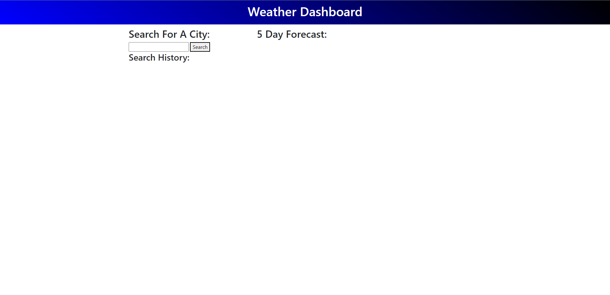
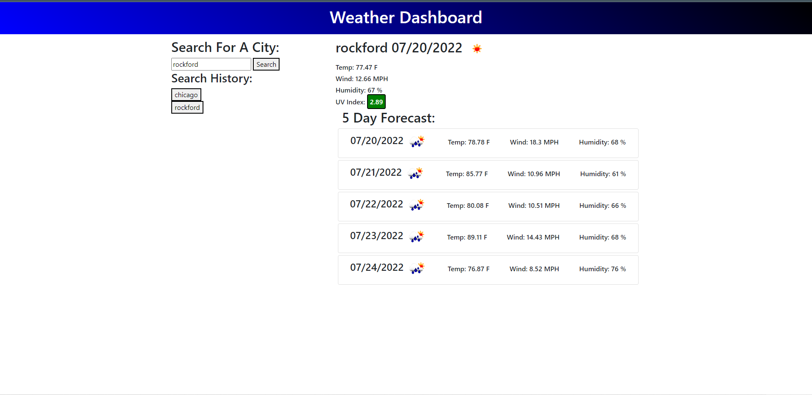

# Forecast-outlook

This is a weather dashboard that shows current weather for each city searched and future weather conditions. 

# Made with
* HTML
* CSS
* JavaScript
* Bootstrap
* jQuery
* Server-Side API's

# Process
* Created a boiler plate in the index.html file and added nav's, div's, links, and script src's.
* Styled the weather dashboard in the style.css file.
* Created functioning with in the script.js file and inserted server-side API's. My API key is being used but may not be used by others.
 **(for grading purposes your own apiKey might have to be used)**
* The only bug I believe needs to be corrected is saving to local storage. 

# URL link to forecast-outlook 
* http://127.0.0.1:5503/index.html

# Screenshots

